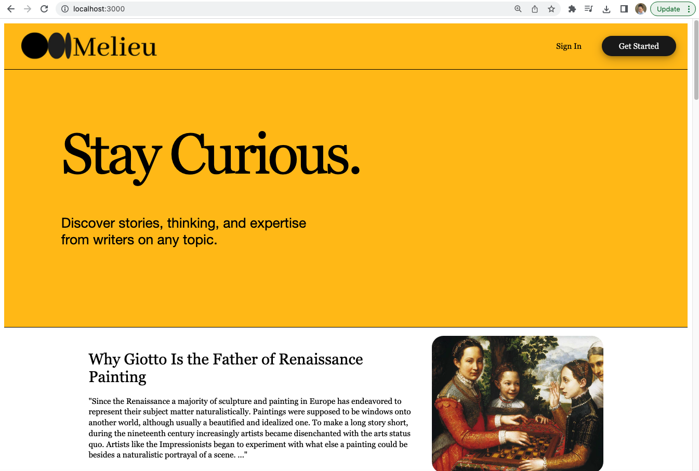
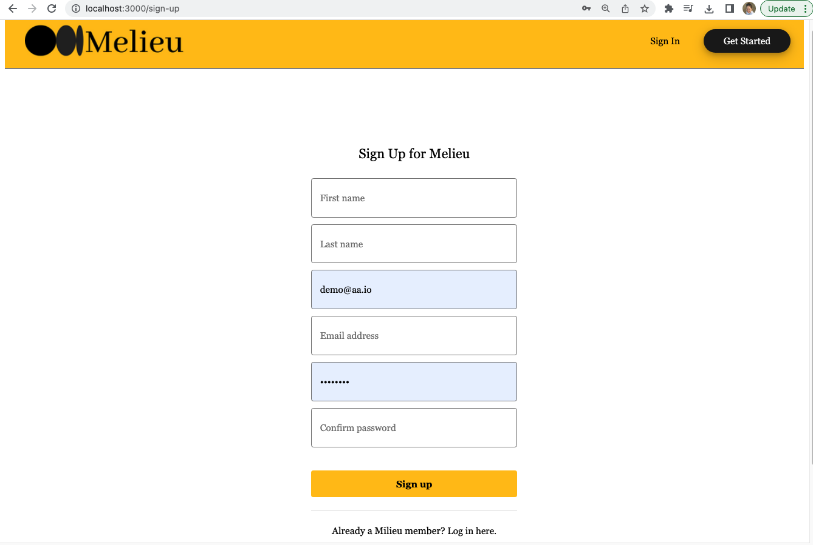
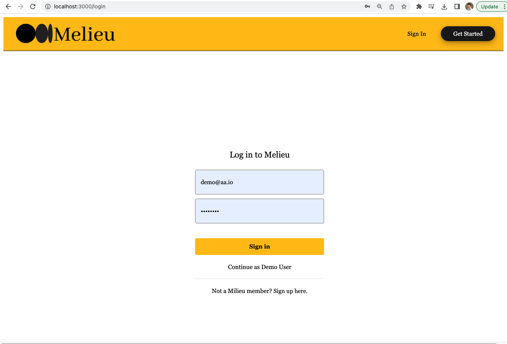
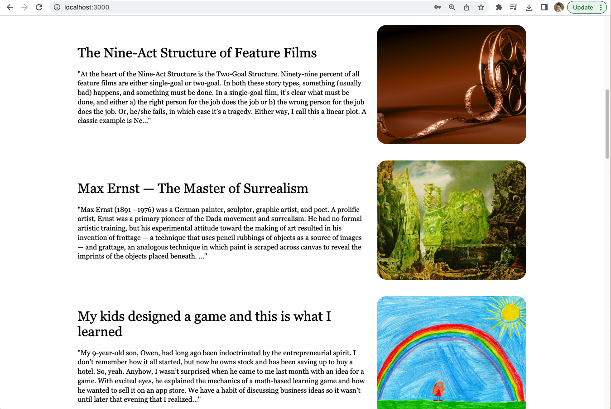
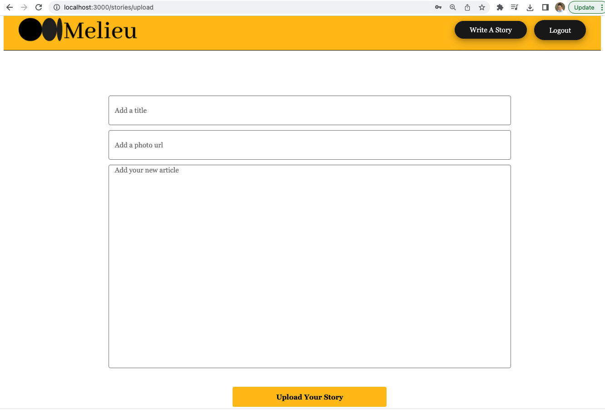
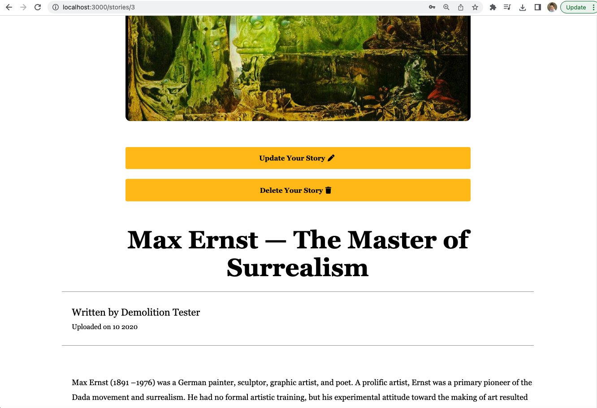
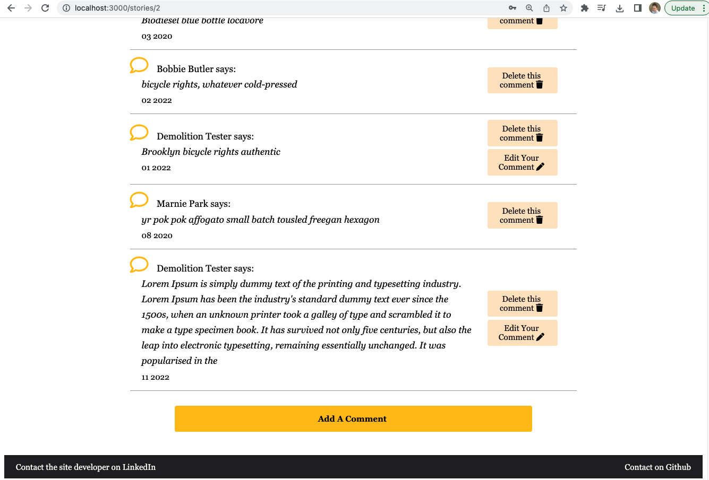
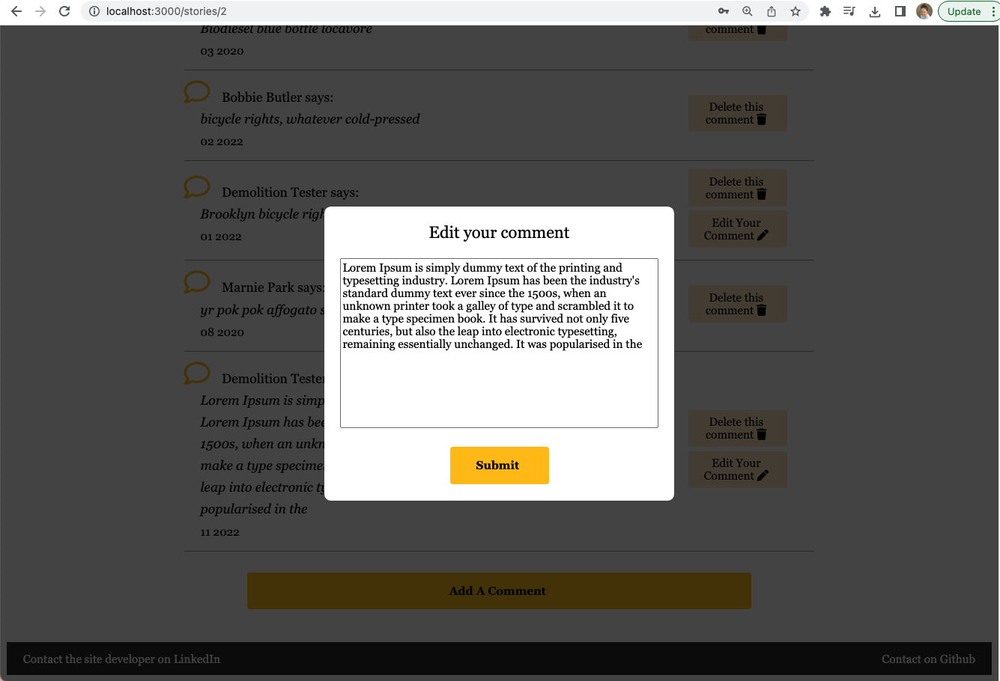

# Melieu

## A Medium clone by Eliza Wimberly

---

## 🔎 Contents:

- Features
- Download
- Upcoming
- Tech Stack
- Connect

---

## 📸 Features:

---

## Splash Page and User Navigation

---

When first landing on Melieu home page, the user sees a splash page with a navbar that has Sign In and Get Started option which are accessed by clicking on either button on the top right of the navigation bar.

---



---

If the user selects Get Started, they are directed to a sign up form where they can sign up as a new user. Alternately, if the user selects Sign In, the user can log in as a returning user or chose an option to log in as a demo user.

---



---



---

### Stories Feed

---

Another feature of the splash page is the stories feed. Below the naviagation bar and the yellow Melieu welcome banner, there is a stories feed that features a column of preview blurbs for each story available on Melieu. A user can simply scroll down to see all the different stories available to read, and can click on one to be directed to the full Story Details Page.
This features the interactive element of the app by display all the stories a user can read.

---



---

When the user wants to upload a story, while the user is logged-in there is always a button displayed in the upper right navigation bar that says Write A Story. When a user clicks that button, they are directed to a Story Form where they can add a title, image, and story content to post a new story.

---



---

Once a user submits their story information successfully, they are redirected to a Story Details Page that will feature the story image, title, and content of their new story. On the Story Details Page of a story that is written by the logged-in user, there will be buttons displayed under the story image banner that allow the user to update or delete the story they have posted.

---



---

## Comments

---

A user can read all comments that are posted about a specific story on the Story Details Page. A logged-in user is given the option to add their own comment at the bottom of the comment field by clicking the button Add A Comment that only appears if a user is logged-in. Also, a user is given the option to delete and/or edit any previous comments they have posted by clicking Delete This Comment or Edit Your Comment. If a user posted the story on the Story Details Page, that user is able to delete ANY comment posted about that story. However, the user is only allowed the edit comments that the user themselves posted.

---



---



---

## 📁 Download

- Clone this repository

- Install dependencies

  ```bash
  pipenv install -r requirements.txt
  ```

- Create a **.env** file based on the example with proper settings for your
  development environment

- Make sure the SQLite3 database connection URL is in the **.env** file

- This starter organizes all tables inside the `flask_schema` schema, defined
  by the `SCHEMA` environment variable. Replace the value for
  `SCHEMA` with a unique name, **making sure you use the snake_case
  convention**.

- Get into your pipenv, migrate your database, seed your database, and run your Flask app

  ```bash
  pipenv shell
  ```

  ```bash
  flask db upgrade
  ```

  ```bash
  flask seed all
  ```

  ```bash
  flask run
  ```

- cd into the react-app directory and install dependancies

  ```
  npm install
  ```

- then run your react front end and your browser should automatically open the app on http://localhost:3000/

  ```
  npm start
  ```

---

## ⏱ Upcoming

Upcoming features will include Follows, Likes, Categories, and Bookmarks!

---

## 📚 Tech Stack

### Framework:

<p>


<br>

### Frontend:

<p>


<br>

### Backend:

<p>


<br>

---

## 🖱 Demo

Check out Milieu for yourself! Click the Melieu icon below to be redirected to the app on Render, the current hosting site for the fullstack API:

<p>
<a href="https://milieu-deploy.onrender.com/"></a>
</p>

---

## 🤝 Connect

This API was brought to you by Eliza Wimberly, please click on my photo to connect on linkedIn!

<p>
  <a href="https://www.linkedin.com/in/eliza-wimberly-773896205/"></a>
</p>
